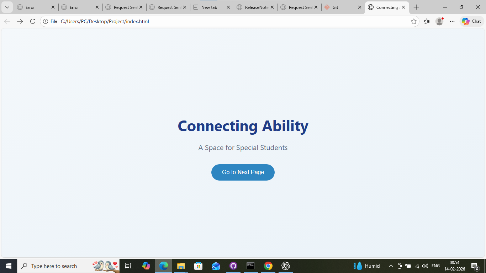
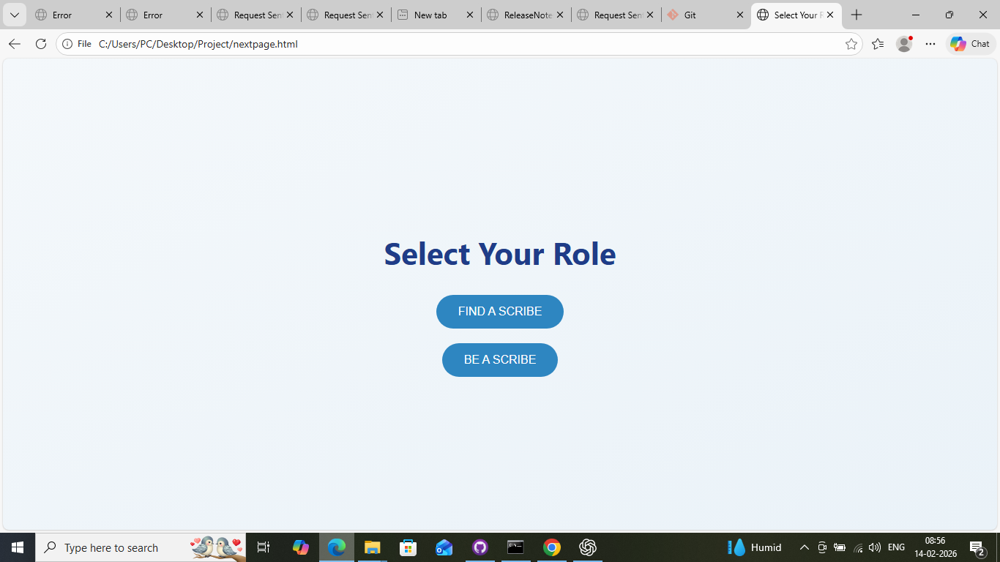
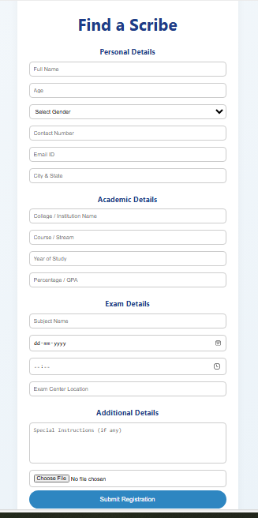
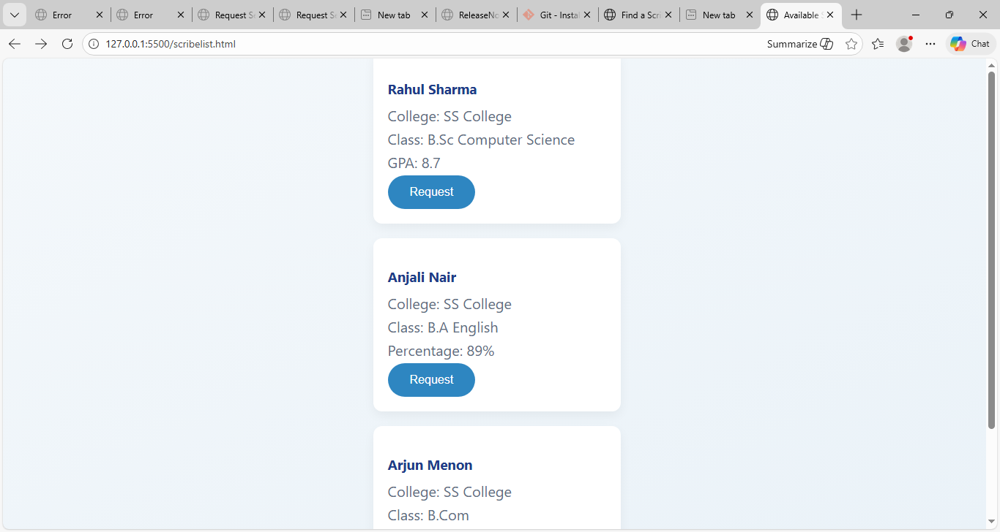

# scribeconnect🎯

## Basic Details

### Team Name: CREATE!

### Team Members
- Member 1: Aysha zanha M - sullamussalam science college
- Member 2: shafeequa TK - sullamussalam science college 

### Hosted Project Link
(https://github.com/shafeequa1/ScribeConnect)

### Project Description
digital platform that connects differently abled students who require assistance during examinations with quilified students volunterees willing to act as scribes

### The Problem statement
Differently abled students struggle to find eligible scribes in a timely and organized manner. There is no centralized, ethical platform that connects student volunteers with students in need of examination writing assistance.

### The Solution
Our platform centralizes the registration and matching process between scribes and students. It ensures eligibility through qualification-based matching and promotes ethical compliance through mandatory declarations. This structured system reduces stress and improves accessibility for examinations.

**For Software:**
- Languages used: JavaScript,html,css
- Tools used: VS Code, Git

---

## Features

List the key features of your project:
- Feature 1: Designed to support disabled students
- Feature 2: Help to find a suitable scribe
- Feature 3: A space for students who want to volunteer
## Project Documentation
 
### For Software:

#### Screenshots (Add at least 3)

  

  

  

  

### Video Demo

- We had difficulties with our laptops

**Tool Used:**  ChatGPT

**Purpose:**
- Debugging assistance
- content assistance

**Key Prompts used**
- Debug this async function that's causing error

**Percentage of AI-generated code:** Approximately 50%

**Human Contributions:**
- Architecture design and planning
- Custom business logic implementation
- Integration and testing
- UI/UX design decisions

---

## Team Contributions

- Aysha Zanha M: Frontend development
- shafeequa TK: Frontend development

---

## License

This project is licensed under the MIT License - see the [LICENSE](LICENSE) file for details.
